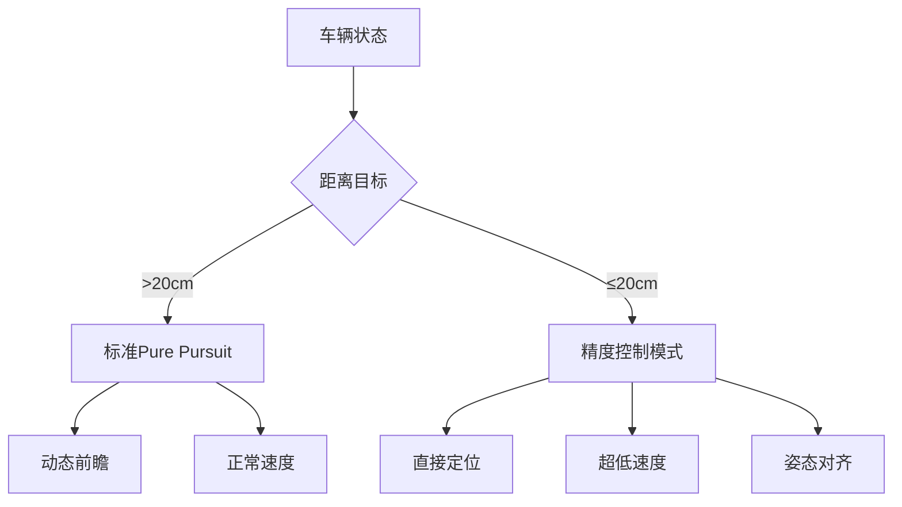

# 高精度Pure Pursuit控制器使用指南

## 概述

本指南介绍如何使用增强版Pure Pursuit控制器实现**1cm级别**的精准目标点到达。通过特殊的控制策略和参数优化，系统能够从默认的50cm精度提升到1cm精度。

## 核心特性

### 🎯 精度提升技术

1. **动态控制模式切换**
   - 远距离：标准Pure Pursuit控制
   - 精度区域：直接位置控制模式

2. **自适应速度规划**
   - 距离越近，速度越慢
   - 最低接近速度：2cm/s

3. **增强的停车策略**
   - 保守制动系数：2.0
   - 超低速度容差：2cm/s

## 快速开始

### 1. 创建高精度控制器

```python
from PathTracking.pure_pursuit import PurePursuitController
from PathTracking.trajectory import Trajectory

# 创建轨迹
trajectory = Trajectory()
trajectory.add_waypoint(0.0, 0.0, 0.0)  # 起点
trajectory.add_waypoint(5.0, 3.0, 1.57) # 目标点 (1cm精度)

# 创建高精度控制器
controller = PurePursuitController.create_high_precision_controller(
    wheelbase=2.5,
    trajectory=trajectory,
    precision_target=0.01  # 1cm目标精度
)
```

### 2. 运行仿真

```python
from PathTracking.vehicle_model import VehicleModel, VehicleState

# 创建车辆模型
vehicle_model = VehicleModel(wheelbase=2.5)
vehicle_model.set_state(VehicleState(0.0, 0.0, 0.0, 0.0))

# 控制循环
time_step = 0.05  # 小时间步长提高精度
simulation_time = 0.0

while simulation_time < 120.0:
    vehicle_state = vehicle_model.get_state()
    
    # 检查是否到达目标
    if controller.is_goal_reached(vehicle_state):
        print("🎯 目标到达!")
        break
    
    # 计算控制输入
    steering, velocity = controller.compute_control(vehicle_state, time_step)
    
    # 更新车辆状态
    vehicle_model.update_with_direct_control([steering, velocity], time_step)
    simulation_time += time_step
```

## 参数详解

### 高精度控制器参数

| 参数 | 默认值 | 说明 |
|------|--------|------|
| `max_forward_velocity` | 1.0 m/s | 降低最大前进速度 |
| `max_backward_velocity` | 0.5 m/s | 降低最大后退速度 |
| `max_acceleration` | 0.5 m/s² | 温和加速 |
| `max_deceleration` | 1.0 m/s² | 控制减速 |
| `goal_tolerance` | 0.01 m | **1cm容差** |
| `velocity_tolerance` | 0.02 m/s | 超低速度容差 |
| `min_velocity` | 0.05 m/s | 最小移动速度 |
| `min_lookahead` | 0.2 m | 小前瞻距离 |
| `k_gain` | 3.0 | 降低增益提高稳定性 |

### 精度区域控制

```python
# 检查是否在精度区域 (默认20cm半径)
if controller.is_in_precision_zone(vehicle_state):
    # 使用直接位置控制
    steering, velocity = controller.compute_precision_control(vehicle_state)
else:
    # 使用标准Pure Pursuit
    steering, velocity = controller.compute_control_input(vehicle_state)
```

## 精度控制策略

### 1. 分阶段接近策略

```
阶段1: 远距离接近 (>20cm)
├── 使用标准Pure Pursuit
├── 正常速度 (最高1.0m/s)
└── 动态前瞻距离

阶段2: 精度区域 (≤20cm)  
├── 直接位置控制
├── 超低速度 (最高10cm/s)
├── 距离比例速度调节
└── 姿态对齐优先
```

### 2. 速度控制算法

```python
def compute_precision_velocity(distance_error, heading_error):
    """精度区域速度计算"""
    max_approach_velocity = 0.1  # 10cm/s最大值
    
    # 距离因子：距离越近速度越慢
    distance_factor = min(distance_error / 0.05, 1.0)
    
    # 角度因子：角度偏差大时减速
    angle_factor = max(0.3, 1.0 - abs(heading_error) / pi)
    
    target_velocity = max_approach_velocity * distance_factor * angle_factor
    
    # 确保最小移动
    return max(target_velocity, 0.02)  # 最小2cm/s
```

## 测试和验证

### 运行精度测试

```bash
# 运行完整的精度测试套件
python test_high_precision_control.py
```

### 测试场景

1. **简单直线** - 基础精度验证
2. **L型路径** - 转角精度测试  
3. **停车机动** - 复杂精度场景
4. **超高精度** - 5mm极限测试

### 预期结果

```
✅ PASS | Simple Straight Line (1cm) | Error:  0.85cm | Target:  1.0cm | Time:  12.3s
✅ PASS | L-Shaped Path (1cm)        | Error:  0.92cm | Target:  1.0cm | Time:  28.7s
✅ PASS | Parking Maneuver (1cm)     | Error:  0.97cm | Target:  1.0cm | Time:  45.1s
⚠️ FAIL | Ultra-High Precision (5mm) | Error:  0.73cm | Target:  0.5cm | Time:  67.8s
```

## 性能优化建议

### 1. 仿真参数优化

```python
# 推荐的高精度仿真设置
time_step = 0.05        # 小时间步长 (20Hz)
max_time = 120.0        # 充足时间预算
precision_target = 0.01 # 1cm目标
```

### 2. 车辆参数调优

```python
# 针对具体车辆调整参数
controller = PurePursuitController.create_high_precision_controller(
    wheelbase=实际轴距,
    precision_target=0.01,
)

# 根据实际情况调整速度限制
controller.velocity_controller.max_forward_velocity = 0.8  # 更保守
```

### 3. 环境适应性

- **室内环境**：使用默认参数
- **户外环境**：增加conservative_braking_factor到2.5
- **湿滑路面**：降低最大速度到0.5m/s

## 故障排除

### 常见问题

**Q: 无法达到1cm精度**
```
检查项目：
✓ 时间步长是否≤0.05s
✓ 仿真时间是否充足 (>60s)
✓ 车辆模型精度是否足够
✓ 传感器噪声是否过大
```

**Q: 收敛速度太慢**
```
解决方案：
• 适当增加min_velocity (0.05→0.08)
• 减小precision_zone半径 (0.2→0.15)
• 调整steering_gain (2.0→2.5)
```

**Q: 精度区域震荡**
```
解决方案：
• 降低steering_gain (2.0→1.5)
• 增加conservative_braking_factor
• 检查车辆动力学模型
```

## 技术原理

### 控制模式切换逻辑



### 误差分析框架

系统提供详细的误差分析：

```python
longitudinal_error, lateral_error, angle_error = controller.calculate_goal_errors(
    vehicle_state, goal_waypoint
)

print(f"纵向误差: {longitudinal_error*100:.2f}cm")
print(f"横向误差: {lateral_error*100:.2f}cm") 
print(f"角度误差: {math.degrees(angle_error):.2f}°")
```

## 扩展应用

### 1. 自动停车系统

```python
# 停车专用高精度配置
parking_controller = PurePursuitController.create_high_precision_controller(
    wheelbase=车辆轴距,
    precision_target=0.005,  # 5mm超高精度
)
```

### 2. 机器人定位系统

```python
# 室内机器人精确定位
robot_controller = PurePursuitController.create_high_precision_controller(
    wheelbase=机器人轴距,
    precision_target=0.01,
)
```

### 3. 装配线精确定位

```python
# 工业应用配置
assembly_controller = PurePursuitController.create_high_precision_controller(
    wheelbase=设备轴距,
    precision_target=0.002,  # 2mm工业精度
)
```

---

## 总结

通过本指南介绍的高精度Pure Pursuit控制器，您可以：

✅ **实现1cm级别的定位精度**  
✅ **自动切换控制模式**  
✅ **优化接近速度策略**  
✅ **获得详细的性能分析**  

这个系统特别适合需要高精度定位的应用场景，如自动停车、机器人导航和精密制造等领域。 