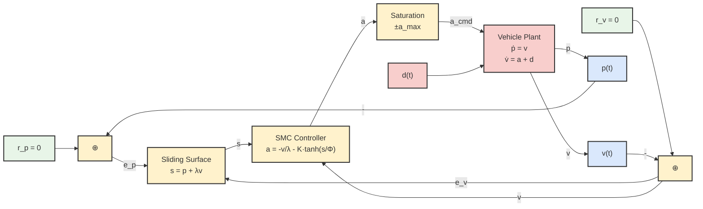
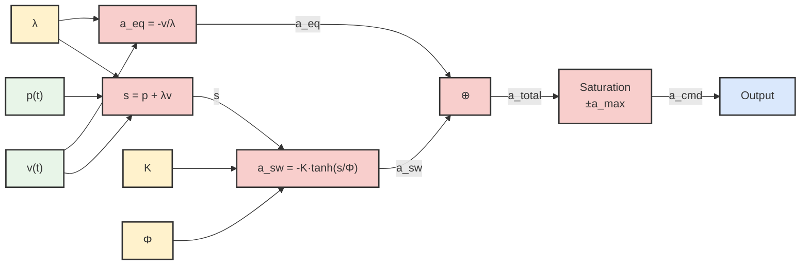
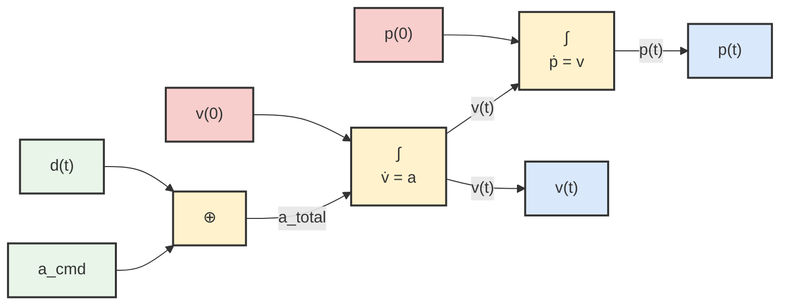
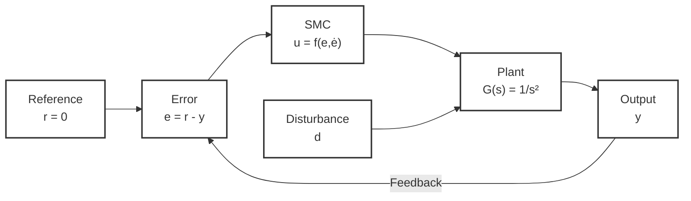

# Sliding Mode Control (SMC) Block Diagram

This document provides a comprehensive block diagram representation of the Sliding Mode Control system implemented in `sliding_mode_control.py`.

## System Overview

The SMC system controls a vehicle to reach the origin (position = 0, velocity = 0) from any initial state, with robustness against bounded disturbances.

## Main Control Block Diagram



## Detailed SMC Controller Structure



## Vehicle System Dynamics



## Simplified Control Structure



## Control Law Mathematical Breakdown

### Sliding Surface Design
- **Sliding Surface**: `s(t) = p(t) + λv(t)`
- **Purpose**: Combines position and velocity errors with adjustable coupling
- **Parameter λ**: Controls the slope of the sliding line in phase space

### Control Components

#### 1. Equivalent Control
```
a_eq = -v(t)/λ
```
- **Purpose**: Maintains sliding motion when no disturbance is present
- **Behavior**: Provides smooth control when system is on sliding surface

#### 2. Switching Control
```
a_sw = -K · tanh(s(t)/Φ)
```
- **Purpose**: Ensures robustness against bounded disturbances
- **K**: Switching gain (must be > disturbance bound)
- **Φ**: Boundary layer thickness (reduces chattering)
- **tanh**: Smooth approximation of sign function

#### 3. Total Control Law
```
a_total = a_eq + a_sw = -v(t)/λ - K · tanh(s(t)/Φ)
```

### Stability Analysis

#### Lyapunov Function
```
V(t) = 0.5 · s(t)²
```

#### Stability Condition
```
V̇(t) = s(t) · ṡ(t) < 0  (when |s| > Φ)
```

This ensures the system converges to the sliding surface and then to the origin.

## Parameter Tuning Guidelines

| Parameter | Symbol | Effect | Typical Range |
|-----------|--------|---------|---------------|
| Sliding slope | λ | Convergence speed and overshoot | 0.5 - 2.0 |
| Switching gain | K | Disturbance rejection | 1.5 - 5.0 |
| Boundary layer | Φ | Chattering vs. accuracy | 0.01 - 0.5 |
| Acceleration limits | a_min, a_max | Actuator constraints | ±5.0 m/s² |

## Implementation Notes

1. **Chattering Reduction**: Uses `tanh` instead of `sign` function
2. **Actuator Saturation**: Clips control output to realistic limits
3. **Numerical Integration**: Euler method with configurable time step
4. **Convergence Detection**: Threshold-based stopping criterion
5. **Disturbance Handling**: Supports arbitrary disturbance functions

## Usage Example

```python
# Create controller
controller = SlidingModeController(
    lambda_param=1.0,  # Sliding surface slope
    K=2.0,            # Switching gain  
    phi=0.1           # Boundary layer thickness
)

# Create vehicle system
vehicle = VehicleSystem(
    initial_position=10.0,
    initial_velocity=5.0,
    disturbance_function=lambda t: 0.8 * np.sin(2*np.pi*0.5*t)
)

# Run simulation
simulator = SMCSimulator(controller, vehicle)
results = simulator.run_simulation()
```

This block diagram representation provides a complete understanding of the SMC control system architecture and its mathematical foundations. 