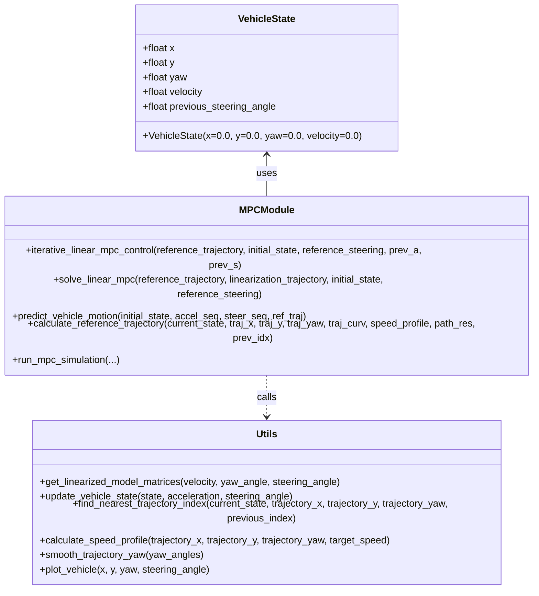
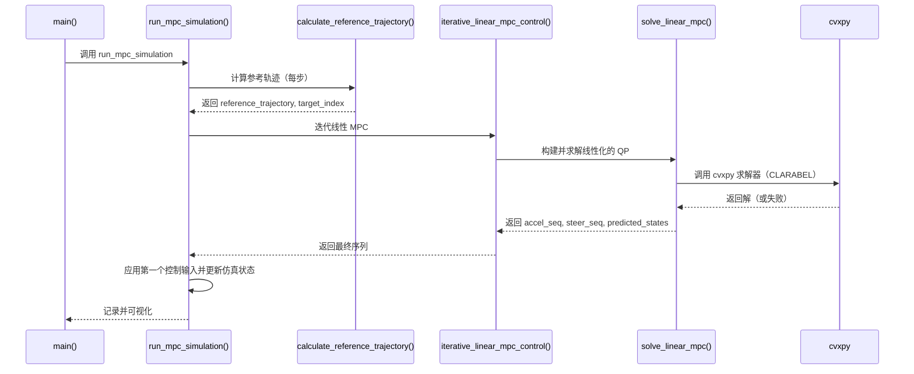

# 1. 模块说明：Model Predictive Speed and Steer Control

本文档概述 `model_predictive_speed_and_steer_control.py` 的设计、关键函数与数据流，并用 UML 图（mermaid 语法）说明模块结构与运行流程，便于快速理解和维护。

## 1.1. 目标（概览）
- 实现对车辆的速度与转向的迭代线性化 MPC（Model Predictive Control）。
- 在有限预测步长内同时优化加速度和前轮转角，使车辆跟踪参考轨迹。

## 1.2. 文件位置
- 源文件：`experiments/model_predictive_speed_and_steer_control/model_predictive_speed_and_steer_control.py`

---

## 1.3. 关键类与结构

- VehicleState：表示当前车辆状态（x, y, yaw, velocity, previous_steering_angle）。
- 常量定义：状态维度、控制维度、预测步长、代价矩阵、约束、仿真参数等。
- 关键模块函数（模块级）：
  - `get_linearized_model_matrices(velocity, yaw_angle, steering_angle)`
  - `update_vehicle_state(state, acceleration, steering_angle)`
  - `predict_vehicle_motion(initial_state, acceleration_sequence, steering_sequence, reference_trajectory)`
  - `iterative_linear_mpc_control(reference_trajectory, initial_state, reference_steering, previous_acceleration, previous_steering)`
  - `solve_linear_mpc(reference_trajectory, linearization_trajectory, initial_state, reference_steering)`
  - `calculate_reference_trajectory(...)`
  - `run_mpc_simulation(...)`
  - 工具函数：`find_nearest_trajectory_index`, `calculate_speed_profile`, `smooth_trajectory_yaw`, `plot_vehicle` 等。

## 1.4. 数据契约（简短）
- 状态向量 $x \in \mathbb{R}^4$： $[x, y, v, \psi]$
- 控制向量 $u \in \mathbb{R}^2$： $[a, \delta]$
- 参考轨迹：数组形状 $(4, \text{PREDICTION\_HORIZON}+1)$
- 预测步数：PREDICTION_HORIZON（常量）
- 返回值/成功判定：`solve_linear_mpc` 在求解成功时返回数值序列，否则返回 None 并打印错误。

## 1.5. 主要误差/边界情况（工程注意）
- 非凸或不可行的 QP 可能导致求解失败（已打印错误）。
- 线性化点偏差过大时需要更多迭代或更好的初始化。
- 轨迹末端速度为 0，若车辆未能准确停止可能出现摆动。
- 角度跳变问题通过 `smooth_trajectory_yaw` 进行预处理。

---

## 1.6. UML 类图（mermaid）

以下 mermaid 类图描述模块中主要的类与函数间关系：



说明：模块是以函数式/过程式为主的实现，`MPCModule` 在此图中抽象为包含多个顶级函数的逻辑单元，`Utils` 封装动力学线性化与工具函数。

---

## 1.7. UML 时序图（主要运行流程）

展示从 `main()` 启动到求解并应用控制输入的典型调用顺序：



---

## 1.8. 模块核心算法说明（要点）

1. 线性化模型：
    - 使用函数 `get_linearized_model_matrices` 在当前速度、偏航与转角处构造离散时间线性系统 $x_{k+1} = A x_k + B u_k + C$。
    - 对前轮转角进行了 cos^2 修正（参见 B/C 的计算表达式）。

2. 迭代线性 MPC：
    - `iterative_linear_mpc_control` 通过多次（MAX_ITERATIONS）在当前轨迹点处线性化并求解线性 MPC，直到控制序列收敛。
    - 每次迭代先用当前控制序列做前向仿真（`predict_vehicle_motion`），再基于该轨迹线性化并调用 `solve_linear_mpc`。

3. 线性 MPC 问题构建：
    - 变量：状态序列 $(4, N+1)$、控制序列 $(2, N)$
    - 目标：状态跟踪代价 + 控制量惩罚 + 控制变化率惩罚 + 终端代价
    - 约束：动力学、速度上下界、加速度与转向角限幅、转向速率限幅
    - 求解器：cvxpy + CLARABEL

---

## 1.9. 重点公式与线性化推导（数学细节）

下面给出脚本中用到的关键动力学、线性化过程与 MPC 目标函数的数学表达，便于工程复现与推理验证。

1) 连续时间单轨（bicycle）模型（状态变量 $x = [X, Y, v, \psi]$，控制 $u = [a, \delta]$）：

$$
\dot X = v \cos\psi \\
\dot Y = v \sin\psi \\
\dot v = a \\
\dot \psi = \frac{v}{L} \tan\delta
$$

其中 $L$ 为轴距（WHEELBASE）。上述为非线性模型，脚本通过离散化并线性化用于 MPC。

2) 离散化（显式欧拉，步长 $\Delta t = $ TIME_STEP）：

$$
X_{k+1} = X_k + \Delta t\, v_k \cos\psi_k \\
Y_{k+1} = Y_k + \Delta t\, v_k \sin\psi_k \\
v_{k+1} = v_k + \Delta t\, a_k \\
\psi_{k+1} = \psi_k + \Delta t\, \frac{v_k}{L} \tan\delta_k
$$

3) 关于状态与控制的一阶泰勒线性化（在 $(x_0, u_0)$ 处）：

$$
x_{k+1} \approx A x_k + B u_k + C
$$

其中

$$
A = I + \Delta t \frac{\partial f}{\partial x}\Big|_{(x_0,u_0)}, \quad
B = \Delta t \frac{\partial f}{\partial u}\Big|_{(x_0,u_0)}
$$

偏导项（脚本实现对应）显示如下：

- $\dfrac{\partial X_{k+1}}{\partial v} = \Delta t \cos\psi_0$
- $\dfrac{\partial X_{k+1}}{\partial \psi} = -\Delta t \, v_0 \sin\psi_0$
- $\dfrac{\partial Y_{k+1}}{\partial v} = \Delta t \sin\psi_0$
- $\dfrac{\partial Y_{k+1}}{\partial \psi} = \Delta t \, v_0 \cos\psi_0$
- $\dfrac{\partial \psi_{k+1}}{\partial v} = \Delta t \, \dfrac{\tan\delta_0}{L}$

对控制的偏导数（B 矩阵）：

- $\dfrac{\partial v_{k+1}}{\partial a} = \Delta t$
- $\dfrac{\partial \psi_{k+1}}{\partial \delta} = \Delta t \, \dfrac{v_0}{L \cos^2\delta_0}$

注意事项：当 $|\cos\delta_0|$ 很小时（接近 $\pm\pi/2$），上述项会变大，数值不稳定；代码通过限制最大转角（MAX_STEERING_ANGLE）与合适的初值来缓解。

4) MPC 二次目标函数（离散形式）：

$$
J = \sum_{k=0}^{N-1} (x_k - x^{\mathrm{ref}}_k)^T Q (x_k - x^{\mathrm{ref}}_k) + u_k^T R u_k
     + \sum_{k=0}^{N-2} (u_{k+1}-u_k)^T S (u_{k+1}-u_k)
     + (x_N - x^{\mathrm{ref}}_N)^T Q_f (x_N - x^{\mathrm{ref}}_N)
$$

- $Q$ 为状态罚矩阵（STATE_COST_MATRIX），$R$ 为输入罚矩阵（INPUT_COST_MATRIX），
  $S$ 为输入变化率罚矩阵（INPUT_RATE_COST_MATRIX），$Q_f$ 为终端罚矩阵（TERMINAL_STATE_COST_MATRIX）。

该目标是标准二次目标，cvxpy 将其转为二次规划 QP 求解。

5) 约束（实现要点）：

- 动力学： $x_{k+1} = A x_k + B u_k + C$
- 速度上下界： $v_{\min} \le v_k \le v_{\max}$
- 控制幅值： $|a_k| \le a_{\max},\; |\delta_k| \le \delta_{\max}$
- 转角速率： $|\delta_{k+1} - \delta_k| \le \dot\delta_{\max} \cdot \Delta t$

6) 线性化迭代（逐步逼近）：
- 脚本使用预测轨迹（`predict_vehicle_motion`）基于当前控制序列前向仿真得到线性化点。
- 再基于该轨迹构建 $A,B,C$，通过 `solve_linear_mpc` 求解线性 QP，得到新的控制序列。
- 重复至控制序列差异低于收敛阈值或达到最大迭代次数（MAX_ITERATIONS）。

---

## 1.10. 轨迹计算方法与参考轨迹生成

脚本中参考轨迹由两部分生成与处理：

1) 路径生成（CubicSpline）：
    - 使用仓库内的 `CubicSpline.calc_spline_course(waypoints_x, waypoints_y, ds)` 对离散路标点做三次样条插值，返回连续的路径点集：
      $(\text{trajectory\_x}, \text{trajectory\_y}, \text{trajectory\_yaw}, \text{trajectory\_curvature}, s)$
    - 该实现提供平滑的位姿与曲率，适合用于 MPC 的参考轨迹。

2) 速度剖面（speed_profile）：
    - `calculate_speed_profile` 根据路径方向与期望目标速度 TARGET_SPEED 生成速度序列。
    - 对于可能需要倒退的路段（当运动方向与路径偏航差异过大时），函数会把该段的速度符号设为负以表示反向运动。
    - 最终路径末端被设置为 0（停车）。

3) 参考轨迹截取（for MPC horizon）：
    - `calculate_reference_trajectory` 在每个仿真步找到当前最接近的轨迹点（`find_nearest_trajectory_index`），并从该点向前根据当前车速和步长 dt 推算未来索引（distance_offset = round(|v| * dt * step / path_resolution)）。
    - 结果是形状为 $(4, N+1)$ 的参考状态序列（x,y,v,yaw），并返回用于线性化的参考转向序列（默认 0）。

4) 最近点搜索实现要点：
    - 为提高效率只在之前索引附近的窗口内搜索（NEAREST_INDEX_SEARCH_COUNT）。
    - 返回值同时包含横向误差符号（cross_track_error），便于后续诊断。

---

## 1.11. 数值注意事项与工程建议

- 当使用 cvxpy 求解二次问题时，若 CLARABEL 不可用或遇到数值问题，可切换到 OSQP、OSQP + warm start 或 ECOS，用于稀疏 QP 的场景。可通过 optimization_problem.solve(solver=...) 修改。
- 在构建 B、C 矩阵时要确保 steering_angle 的 cos 不为 0（代码里通过角度限幅与合适的初值避免分母接近 0）。
- 对于长预测时域或高速度场景，线性化误差可能增大：建议增加迭代次数或缩短时间步长 dt 来改善收敛。
- 添加简单的正则化（例如对 Q、R 的最小对角项）能提升求解稳定性。

---

## 1.12. 从线性化到 QP 的具体步骤（逐步构造）

下面给出把脚本中每步线性化得到的局部线性动力学和二次代价组合成标准二次规划（QP）问题的详细步骤。目标是把问题写成：

$$
\min_z \; \tfrac{1}{2} z^T H z + g^T z \quad \text{s.t.}\quad A_{eq} z = b_{eq},\; A_{ineq} z \le b_{ineq}
$$

步骤和记号说明：

- 预测长度为 $N$（脚本中为 `PREDICTION_HORIZON`），状态维度 $n_x=4$，控制维度 $n_u=2$。
- 在每次迭代我们在时间步 $k=0\dots N-1$ 处得到线性化矩阵 $A_k\in\mathbb{R}^{n_x\times n_x}$, $B_k\in\mathbb{R}^{n_x\times n_u}$ 与偏移向量 $C_k\in\mathbb{R}^{n_x}$，这些由 `get_linearized_model_matrices` 计算得到（基于预测轨迹）。
- 参考轨迹为 $x^{\mathrm{ref}}_k$（每步的目标状态），代价矩阵为 $Q$（状态）、$R$（输入）、$S$（输入变化率）、终端代价 $Q_f$。

1) 决策向量的定义：

令决策向量 $z$ 为所有状态和输入的串联：

$$
z = \begin{bmatrix} x_0 \\ x_1 \\ \vdots \\ x_N \\ u_0 \\ u_1 \\ \vdots \\ u_{N-1} \end{bmatrix},
\quad x_k\in\mathbb{R}^{n_x},\; u_k\in\mathbb{R}^{n_u}.
$$

2) 等式（动力学）约束矩阵构造：

对于每一时刻 $k=0..N-1$，离散线性动力学要求：

$$
x_{k+1} = A_k x_k + B_k u_k + C_k.
$$

把所有这些约束写成矩阵形式 $A_{eq} z = b_{eq}$：

- 每个 $k$ 产生 $n_x$ 行的等式，其在 $z$ 中的系数为：
    - 对 $x_{k+1}$：系数为 $I_{n_x}$
    - 对 $x_k$：系数为 $-A_k$
    - 对 $u_k$：系数为 $-B_k$
- 右端项包含偏移 $C_k$（通常移到右侧，作为 $b_{eq}$ 的一部分），并且需要额外的一组行保证初始状态 $x_0 = x_{init}$。

结果是一个稀疏矩阵 $A_{eq}$，行数为 $n_x N + n_x$（包括初始状态约束），列数为 $n_x (N+1) + n_u N$。

3) 不等式约束（边界与速率限制）：

- 速度上下界：对每个 $x_k$ 中的速度分量添加 $v_{\min} \le v_k \le v_{\max}$，可以写成 $A_{ineq} z \le b_{ineq}$ 的两行形式。
- 控制幅值：对每个 $u_k$ 添加 $|u_k| \le u_{\max}$。
- 转角速率（例如对转角分量 $\delta$）：构造差分矩阵 $D$（作用在所有 $u$ 上，使得 $D u = [u_1-u_0, u_2-u_1, ...]^T$），然后添加约束 $|D u| \le \dot\delta_{\max}\,\Delta t$，同样用 $A_{ineq} z \le b_{ineq}$ 表示。

4) 代价（Hessian 和线性项）构造：

代价写为：

$$
J = \sum_{k=0}^{N-1} (x_k - x^{\mathrm{ref}}_k)^T Q (x_k - x^{\mathrm{ref}}_k) + u_k^T R u_k
        + \sum_{k=0}^{N-2} (u_{k+1}-u_k)^T S (u_{k+1}-u_k)
        + (x_N - x^{\mathrm{ref}}_N)^T Q_f (x_N - x^{\mathrm{ref}}_N).
$$

将其写成标准二次形式 $\tfrac{1}{2} z^T H z + g^T z + const$：

- Hessian $H$ 是一个方阵，分块对角（或带少量带状耦合）：
    - 状态部分：在对应的 $x_k$ 位置放置 $2Q$（最后一步放 $2Q_f$），注意 cvxpy 的 quad_form 已隐含因子；若手工组装常用 $Q$ 并在目标前加 $\tfrac{1}{2}$。
    - 控制部分：在对应的 $u_k$ 位置放置 $2R$。
    - 输入变化率项用差分矩阵 $D$ 构造贡献：在 $u$ 的块上加入 $D^T S D$。

- 线性项 $g$ 来自交叉项，例如状态跟踪项会产生 $-2 Q x^{\mathrm{ref}}_k$（或相应的线性化形式），合并到 $g$ 中。常数项可忽略（对优化解无影响）。

注：若使用 cvxpy 直接表达式（如脚本中）不需要显式构造 $H,g$，直接用 `quad_form` 和线性约束即可；但在使用低级 QP 求解器（OSQP, qpOASES 等）或为了性能优化时，显式组装稀疏 $H$ 与约束矩阵是常见做法。

5) 求解并回填：

- 使用 QP 求解器得到最优的 $z^\star$。从 $z^\star$ 中提取 $u_0..u_{N-1}$ 作为本次迭代的控制应用（脚本在 `solve_linear_mpc` 中同时将状态与控制作为 cvx 变量返回）。
- 将得到的控制序列用于下一轮的 `predict_vehicle_motion`（前向仿真），并基于新的预测轨迹重新线性化，进入下一次迭代。

6) 收敛判定与数值小技巧：

- 收敛判定通常基于控制序列的变化量（脚本使用 L1 范数之和与 `CONVERGENCE_THRESHOLD`）。
- 对于稀疏矩阵组装：优先使用稀疏存储（CSR/CSC），避免构造密集矩阵导致内存/速度问题。
- 为提高鲁棒性可在 $H$ 对角加入小的常数（Tikhonov 正则化），以避免半正定或数值奇异情况。

7) 在脚本中的对应点：

- 线性化矩阵 $A_k,B_k,C_k$：由 `get_linearized_model_matrices` 计算（在 `solve_linear_mpc` 的循环中按 time_step 获取）。
- 决策变量与目标：由 cvxpy 中的 `state_variables` 与 `control_variables` 定义，并通过 `quad_form`、等式约束与不等式约束构建问题；cvxpy 对应到上述的 $H,g,A_{eq},b_{eq},A_{ineq},b_{ineq}$。

---


1) 路径生成（CubicSpline）：
    - 使用仓库内的 `CubicSpline.calc_spline_course(waypoints_x, waypoints_y, ds)` 对离散路标点做三次样条插值，返回连续的路径点集：
      (trajectory_x, trajectory_y, trajectory_yaw, trajectory_curvature, s)
    - 该实现提供平滑的位姿与曲率，适合用于 MPC 的参考轨迹。

2) 速度剖面（speed_profile）：
    - `calculate_speed_profile` 根据路径方向与期望目标速度 TARGET_SPEED 生成速度序列。
    - 对于可能需要倒退的路段（当运动方向与路径偏航差异过大时），函数会把该段的速度符号设为负以表示反向运动。
    - 最终路径末端被设置为 0（停车）。

3) 参考轨迹截取（for MPC horizon）：
    - `calculate_reference_trajectory` 在每个仿真步找到当前最接近的轨迹点（`find_nearest_trajectory_index`），并从该点向前根据当前车速和步长 dt 推算未来索引（distance_offset = round(|v| * dt * step / path_resolution)）。
    - 结果是形状为 (4, N+1) 的参考状态序列（x,y,v,yaw），并返回用于线性化的参考转向序列（默认 0）。

4) 最近点搜索实现要点：
    - 为提高效率只在之前索引附近的窗口内搜索（NEAREST_INDEX_SEARCH_COUNT）。
    - 返回值同时包含横向误差符号（cross_track_error），便于后续诊断。

---

## 1.13. 数值注意事项与工程建议

- 当使用 cvxpy 求解二次问题时，若 CLARABEL 不可用或遇到数值问题，可切换到 OSQP、OSQP + warm start 或 ECOS，用于稀疏 QP 的场景。可通过 optimization_problem.solve(solver=...) 修改。
- 在构建 B、C 矩阵时要确保 steering_angle 的 cos 不为 0（代码里通过角度限幅与合适的初值避免分母接近 0）。
- 对于长预测时域或高速度场景，线性化误差可能增大：建议增加迭代次数或缩短时间步长 dt 来改善收敛。
- 添加简单的正则化（例如对 Q、R 的最小对角项）能提升求解稳定性。


## 1.14. 如何渲染 UML
- VS Code 的 Markdown 预览默认不渲染 mermaid。可安装 `Markdown Preview Enhanced` 或在支持 mermaid 的渲染器中打开（GitHub 在仓库 README 中会渲染 mermaid）。
- 也可以把 mermaid 内容粘到 https://mermaid.live/ 即时渲染。

---

## 1.15. 如何运行（快速）
1. 创建并激活 Python 虚拟环境，安装依赖（见仓库根目录的 `pyproject.toml` / `requirements.txt`）。
2. 在仓库根目录运行：

```bash
python experiments/model_predictive_speed_and_steer_control/model_predictive_speed_and_steer_control.py
```

（脚本默认会显示动画，如果要关闭可在文件顶部将 `SHOW_ANIMATION = False`）

---

## 1.16. 参考轨迹跟踪改进建议（重要）

### 1.16.1. 当前实现的问题
当前的MPC控制器使用固定的参考轨迹点进行跟踪，存在以下问题：
- **参考点固定**：强制车辆跟踪预定义的固定点，无法处理路径偏离
- **预测轨迹受限**：预测轨迹只能沿着预定义路径"滑动"，不能自由伸展
- **误差混合**：横向误差和纵向误差混合在一起，无法分别优化

### 1.16.2. 基于横向误差的改进方案

#### 核心思想
使用**预测轨迹到参考轨迹的横向误差**作为主要跟踪目标，而不是固定的参考轨迹点。

#### 具体改进
1. **分离横向和纵向误差**：
   ```python
   def calculate_lateral_error(predicted_state, reference_path):
       # 计算横向误差（垂直于路径方向的距离）
       lateral_error = np.cross(path_tangent, position_vector)
       # 计算纵向误差（沿路径方向的距离）
       longitudinal_error = np.dot(position_vector, path_tangent)
       return lateral_error, longitudinal_error
   ```

2. **修改MPC目标函数**：
   ```python
   # 主要惩罚横向误差（路径跟踪精度）
   total_cost += LATERAL_COST_WEIGHT * cvxpy.square(lateral_error)
   # 次要惩罚纵向误差（速度跟踪）
   total_cost += LONGITUDINAL_COST_WEIGHT * cvxpy.square(longitudinal_error)
   ```

3. **动态参考点选择**：
   - 根据预测轨迹动态选择参考点
   - 考虑预测轨迹的"意图"，选择前瞻参考点
   - 允许参考轨迹根据当前状态和预测动态调整

#### 优势分析
- **更好的路径跟踪**：专注于横向误差，这是路径跟踪的关键
- **更强的鲁棒性**：当车辆偏离路径时，能更好地引导回到路径
- **更自然的控制**：符合人类驾驶习惯，减少不必要的控制动作
- **更好的收敛性**：横向误差通常比位置误差更容易收敛

#### 建议的权重设置
```python
LATERAL_COST_WEIGHT = 10.0      # 横向误差最重要
YAW_COST_WEIGHT = 5.0           # 偏航角次重要
VELOCITY_COST_WEIGHT = 2.0      # 速度跟踪
LONGITUDINAL_COST_WEIGHT = 1.0  # 纵向位置最不重要
```

### 1.16.3. 实现建议
1. **渐进式改进**：
   - 首先实现横向误差计算函数
   - 然后修改MPC目标函数
   - 最后添加动态参考点选择

2. **安全约束**：
   - 始终保证预测轨迹在安全范围内
   - 添加碰撞检测和避障约束
   - 保持与参考路径的合理距离

3. **参数调优**：
   - 根据实际测试调整权重矩阵
   - 平衡跟踪精度和控制平滑性
   - 考虑不同场景下的性能表现

---

## 1.17. 进一步改进建议（小建议）
- 将模块化为类（例如 `MPCController`）以便于单元测试和依赖注入。
- 增加单元测试覆盖 `solve_linear_mpc` 在不可行/边界情况下的行为。
- 将 cvxpy 求解器抽象为可插拔策略，便于在没有 CLARABEL 时回退到 OSQP 等。

---

## 1.18. 变更记录
- 初始文档，描述该脚本的结构、UML 图以及运行/渲染方法。

---

## 1.19. 许可证
与仓库相同的许可证（如有）。
