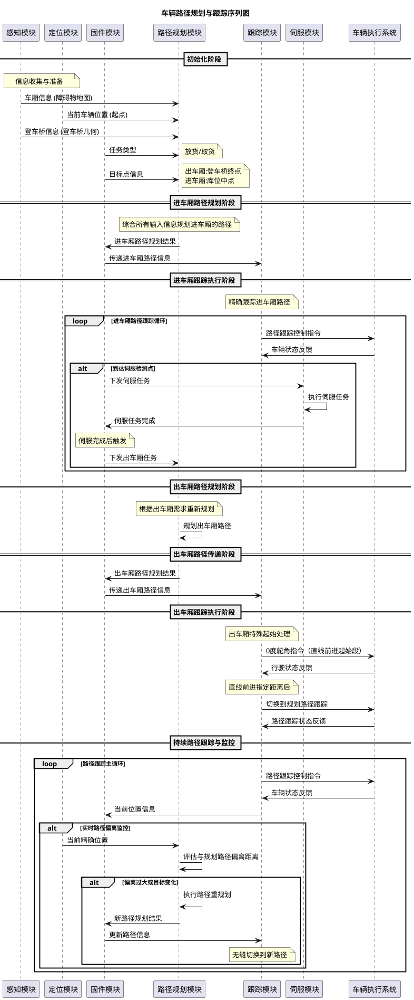

# 流程图



<!-- 有两种路径规划，进车厢和出车厢，

感知 提供车厢信息
固件提供目标点，出车厢时目标点是登车桥的终点，进车厢时目标点是库位中点
定位 提供当前车辆位置，
固件提供登车桥信息，
固件入车厢任务，
固件提供任务类型，放货还是取货

路径规划模块，接收车厢信息，登车车桥信息，起点和目标，规划进车厢的路径，

固件接收到规划的路径，然后传递给跟踪模块

跟踪模块，跟踪入车厢路径，固件判断是否到达伺服检测点，如果到达，下发伺服任务，
伺服模块执行完成，

固件模块下发出车厢任务给路径规划模块，

路径规划模块规划出车厢任务，然后传给固件，
固件再下发给跟踪模块

跟踪模块开始跟踪出车厢的任务，
跟踪出车厢的路径时，起始段需要0度舵，直线前进一段距离，然后再沿着规划的路径进行跟踪，

规划模块可以重规划，如果定位偏离规划的路径太远，或者目标点发生变化时，重规划路径 -->

# 消息接口
## obstacle_map
```protobuf
// Generated by https://github.com/schemas

syntax = "proto3";

import "foxglove/Point2.proto";
import "foxglove/Pose.proto";
import "google/protobuf/timestamp.proto";

package servo_planner;

// Polygon definition: a closed polygon has the same start and end points, an unclosed polygon has different start and end points
message polygon{
  // Vertex information: vertex information for each polygon
  repeated foxglove.Point2 vertexs = 1;
}

// Obstacle definition
message Obstacle{
  // Obstacle ID
  fixed32 obstacle_id = 1;

  // Obstacle type enumeration:
  // | Value | Type            | Description                     |
  // |-------|-----------------|---------------------------------|
  // | -1    | other           | Other/unspecified obstacle type |
  // | 0     | baffle_plate    | Baffle plate obstacle           |
  // | 1     | container_truck | Container truck obstacle        |
  // | 2     | pallet          | Pallet obstacle                 |
  // | 3     | beam            | Beam obstacle                   |
  // | 4     | column          | Column obstacle                 |
  fixed32 obstacle_type = 2;

  // Pose information: obstacle pose information, container truck pose information, pallet pose information, etc.
  foxglove.Pose pose = 3;

  // Velocity information: obstacle's movement speed
  foxglove.Pose velocity = 4;

  // Polygon information: e.g., a container truck body consists of 2 polygons, adaptive space of a pallet consists of 3 polygons
  // Note: The polygon vertices are in global coordinates, not relative to the obstacle's pose
  repeated polygon polygons = 5;
}

// Obstacle map definition
message ObstacleMap{
  // Timestamp
  google.protobuf.Timestamp timestamp = 1;

  // Frame of reference for pose position and orientation
  string frame_id = 2;

  // Obstacle information
  repeated Obstacle obstacles = 3;
}
```
## Path
```protobuf
// Generated by https://github.com/schemas

syntax = "proto3";

package servo_planner;

import "foxglove/Point2.proto";
import "foxglove/Pose.proto";
import "google/protobuf/timestamp.proto";

// Path point definition: individual point on the path
message PathPoint {
  // Position in 2D space (meters)
  double x = 1;
  double y = 2;

  // Orientation as yaw angle (radians, 0 = positive x-axis, positive counter-clockwise)
  double yaw = 3;

  // Path distance: cumulative distance along the path from start (meters)
  double s = 4;

  // Curvature at this point (1/radius, 0 = straight line)
  double curvature = 5;

  // Velocity information: target speed at this point (m/s)
  double target_speed = 6;

  // Direction: 1 for forward, -1 for backward
  int32 direction = 7;

  // Optional: maximum steering angle allowed at this point (radians)
  double max_steering_angle = 8;
}

// Path definition
message Path {
  // Timestamp
  google.protobuf.Timestamp timestamp = 1;

  // Frame of reference for pose position and orientation
  string frame_id = 2;

  // Sequence of path points
  repeated PathPoint points = 3;

  // Path metadata
  PathMetadata metadata = 4;
}

// Path metadata definition
message PathMetadata {
  // Total path length (meters)
  double total_length = 1;

  // Path type enumeration:
  // | Value | Type        | Description              |
  // |-------|-------------|--------------------------|
  // | 0     | normal      | Normal driving path      |
  // | 1     | parking     | Parking maneuver path    |
  // | 2     | loading     | Loading/unloading path   |
  // | 3     | emergency   | Emergency path           |
  int32 path_type = 2;

  // Path quality metrics
  double max_curvature = 3;
  double min_turning_radius = 4;

  // Target completion time (seconds)
  double target_duration = 5;

  // Path ID for tracking
  string path_id = 6;
}
```

## 车厢内取放货物的任务请求信息
```protobuf
// 车厢内取放货物的任务请求信息 - Task request information for loading/unloading goods in carriage
message CarriageGoodsTaskRequestInfo {
  // Timestamp for when this task was created/updated
  google.protobuf.Timestamp timestamp = 1;

  // Current position of the vehicle/forklift
  foxglove.Pose current_position = 2;

  // Task type enumeration for warehouse operations
  enum TaskType {
    UNKNOWN_TASK = 0;                    // Unknown/unspecified task type
    ENTER_CARRIAGE_PUT_GOODS = 1;        // 进车厢放货 - Enter carriage to put goods
    ENTER_CARRIAGE_PICK_GOODS = 2;       // 进车厢取货 - Enter carriage to pick up goods
    PICK_GOODS_EXIT_CARRIAGE = 3;        // 取货出车厢 - Exit carriage with goods
    PUT_GOODS_EXIT_CARRIAGE = 4;         // 放货出车厢 - Exit carriage after putting goods
  }

  // Current task type
  TaskType task_type = 3;

  // 出叉预留直线距离 - Reserved straight line distance for fork exit (meters)
  // This distance ensures safe clearance when the fork extends/retracts
  double fork_exit_reserved_distance = 4;

  Path reference_path

  // Optional: Target position for the task (e.g., storage location or exit point)
  foxglove.Pose target_position = 5;

  // Optional: Task ID for tracking
  string task_id = 6;
}
```

# 场景信息说明

## 车厢信息

- **数据传输格式**: 采用Obstacle Map proto格式进行数据传输
- **传输方式**: 使用Ecal进行数据传输
- **坐标系**: 在全局坐标系下进行定位

## 登车桥信息

- **信息来源**: 登车桥信息从感知模块传递过来
- **数据传输格式**: 采用Obstacle Map proto格式进行数据传输
- **传输方式**: 使用ECal进行数据传输
- **坐标系**: 在全局坐标系下进行定位

## 路径规划模块


# TODO